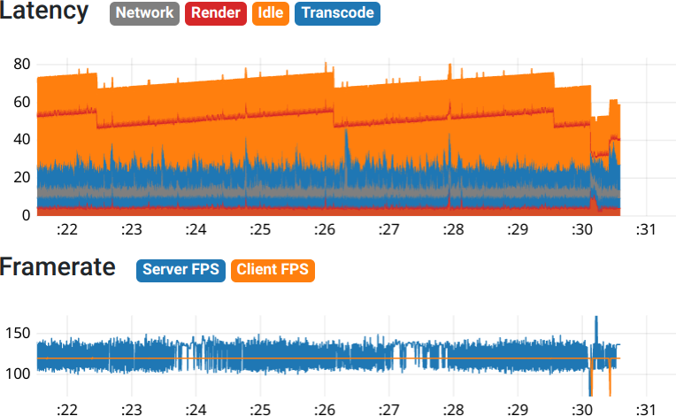

# Settings tutorial

Written as of 2023/02, should be applicable to ALVR v19 and v20.

This tutorial will help you find optimal settings for your hardware and network
as well as give you some pointers to troubleshoot common configuration issues.

## Prerequisites

* You have installed the ALVR streamer on your PC, and the ALVR client on your HMD.
* You can reach the SteamVR void (or the SteamVR home) and are able to launch games.

## Step 1: choose resolution, refresh rate, codec

To get a sharp image, the HMD's native resolution should be used. In ALVR, use the "absolute" setting and type in your HMD's native resolution. For example, the Quest 2 has 1832x1920 pixels per eye, so use a width of 3664 and a height of 1920. Individual games can still have their render scale changed from within the SteamVR overlay setting.

Next, choose a refresh rate. Obviously higher is better, but on weaker/older hardware it's often preferable to use a lower setting that gives consistent results. For the Quest 2, 120 Hz has to be enabled in its settings.

A few notes on codec choices:

* HEVC/H.265 is usually best on AMD hardware, and in bitrate constrained scenarios.
* AVC/H.264 (with CAVLC) may save a few milliseconds of decode latency, but needs a much higher bitrate to reach similar image quality.
* Software encoding (x264) can give good results on a beefy high core-count CPU and a very high bitrate. Will require playing with a USB3 cable. The only choice if you don't have a hardware encoder (eg, RX6500).

## Step 2: tweak encoder settings

Enable foveated encoding. Go to the SteamVR void and look closely at the framerate graph under the latency graph in the statistics tab.

* If the streamer FPS matches the refresh rate you chose in step 1, you can reduce the foveation settings (by increasing the center width/height, or reducing the strength).
* If the streamer FPS is lower than the refresh rate you chose in step 1, increase the foveation settings (by decreasing the center width/height, or increasing the strength).

Repeat until you are at the maximum of what your encoder can do.

## Step 3: tweak bitrate

Slowly increase bitrate until one of two things happen:

* The image freezes for half a second or more periodically (on TCP) or you see a glitched image (on UDP): you have gone beyond what your wireless AP is capable of. Lower the bitrate, or consider using a cable.
* The controllers stop moving, the image flips upside down, and/or becomes just a solid blinking light: the HMD's decoder is unable to keep up. Lower the bitrate.

## Step 4: tweak frame buffering

If you notice micro-stuttering in the client, especially in busy scenes with fast motion, slowly increase maxBufferingFrames until the playback is smooth.

Keep in mind that increasing maxBufferingFrames will linearly increase latency;
if the value that gives a smooth playback results in too high of a latency for
your use case, try a different codec, a lower bitrate and/or stronger foveation
settings.

By that point, your latency graph and your playback should be smooth and consistent. Enjoy!

## Still not satisfied with image quality?

* Tweak the color correction sliders, eg slightly increasing sharpening.
* If using AMF, enable the pre-processor.
* Use the quality encoder preset.
* Try a lower refresh rate and start again from step 2.
* Try a different codec and start again from step 2.
* Try increasing foveation settings (allowing the encoder to use more bits for the center of the image).

See also the
[Troubleshooting](https://github.com/alvr-org/ALVR/wiki/Troubleshooting#common-performance-related-problems)
page for more help.
