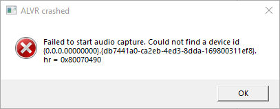
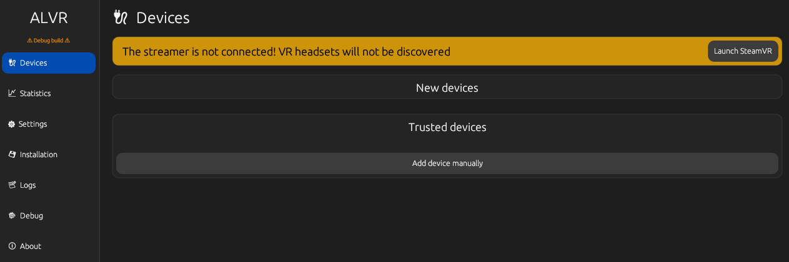
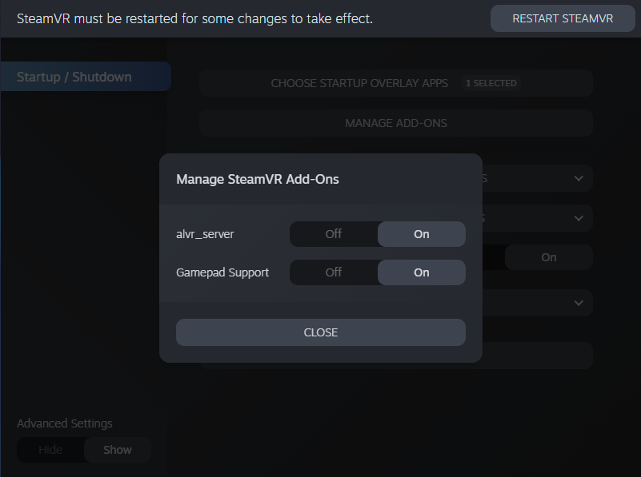
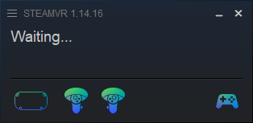
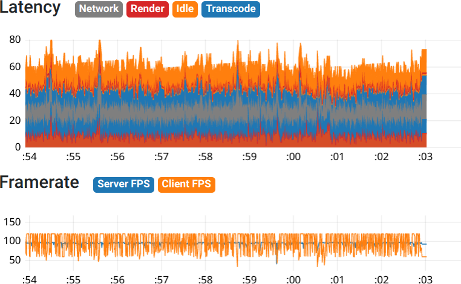
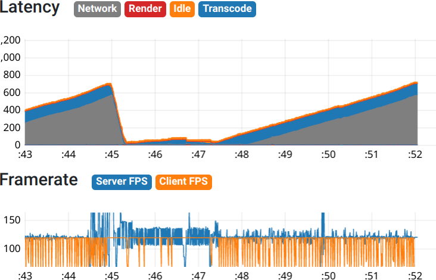
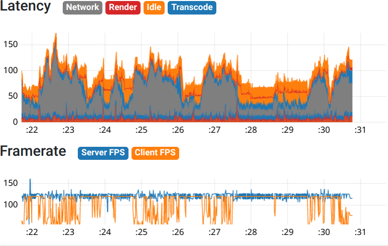
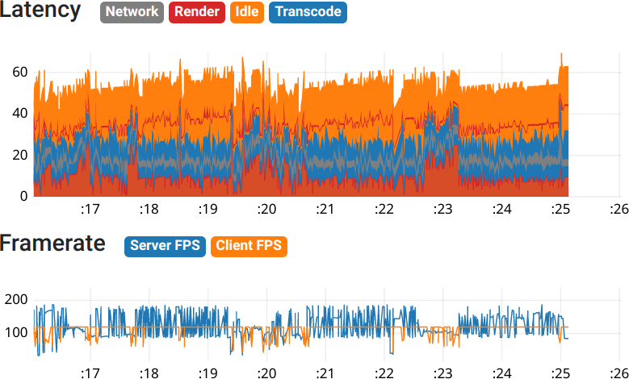
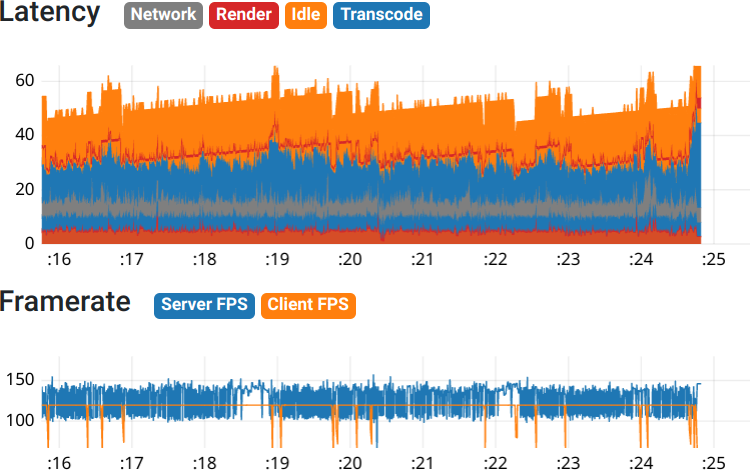

## If you're looking for Linux troubleshooting, please check [here](https://github.com/alvr-org/ALVR/wiki/Linux-Troubleshooting) first, and only then this page.

For ALVR 20.0.0 and later
===

First off, please make sure to carefully read the [Installation guide](https://github.com/alvr-org/ALVR/wiki/Installation-guide) and [Usage](https://github.com/alvr-org/ALVR/wiki/Usage) pages.

The first thing to try is to delete the file `session.json` located in the ALVR installation folder on the PC. This resets everything to default. If it doesn't work, try reinstalling ALVR.

Keep in mind that sometimes a restart of ALVR/SteamVR/PC/Headset will be enough to solve some problems.

Having trouble getting ALVR to work?
---

[I'm having trouble starting ALVR.](#trouble-starting-alvr)

[ALVR starts fine, but says X error.](#alvr-starts-fine-but)

[ALVR starts fine and doesn't show any error, but it doesn't see (or connect to) my headset.](#alvr-cant-see-my-headset)

If you need more help, come to our [Discord](https://discord.gg/KbKk3UM) and ask in the #help channel. When asking for help, please describe the issue, if you're getting an error message, copy it, and tell us what you already tried to fix it.

Trouble starting ALVR
===

ALVR needs a working graphics driver to be installed in order to work.

**On linux**, you also need to make sure you have either `vaapi` on AMD or `cuda` on NVIDIA for hardware encoders to work.

ALVR starts launching, but gets stuck on "ALVR is not responding..."
===

With ALVR versions >= 20.0, some antivirus software can prevent ALVR from launching SteamVR. Try disabling any antivirus other than Windows Defender (McAfee, Norton, etc.), reboot, then try again. If the issue persists, make sure you don't have an instance of ALVR or SteamVR running in the background (check in Task Manager). If you continue having issues, hop in the [ALVR Discord server](https://discord.gg/KbKk3UM), and we'll do our best to help you get it sorted out.

ALVR starts fine, but
===

This section has some advice for when ALVR shows an error (or sometimes warning) pop-up. This could be either a yellow pop-up in the setup window (`ALVR Dashboard.exe`) or a separate pop-up when you connect with a headset.

[WARN] clientFoundInvalid
---

If you get a warning pop-up inside the `ALVR Dashboard.exe` window saying `clientFoundInvalid`, make sure the version of ALVR you installed on your headset is compatible with the version you're trying to run on your PC.

The latest release can be found [here](https://github.com/alvr-org/ALVR/releases/latest) and contains both the `alvr_client.apk` file for your headset and the `alvr_streamer_windows.zip` archive with the application for your PC.

The version of ALVR available on the SideQuest store is compatible with the latest release on GitHub (the previous link). Keep in mind that the version on SideQuest might take us a while to update after a new version is released on GitHub.

Failed to initialize CEncoder
---

ALVR currently needs a recent AMD, Nvidia or Intel GPU to run, since it utilizes hardware video encoding (see [requirements](https://github.com/alvr-org/ALVR#requirements)). If you get an error saying something like

```
Failed to initialize CEncoder. All VideoEncoder are not available. VCE: AMF Error 1. g_AMFFactory.Init(), NVENC: NvEnc NvEncoderD3D11 failed. Code=1 NvEncoder::LoadNvEncApi : NVENC library file is not found. Please ensure NV driver is installed at c:\src\alvr\alvr_server\nvencoder.cpp:70
```

and you have up-to-date GPU drivers, then your graphics card isn't supported. If you're using a laptop with a powerful enough discrete GPU, you _might_ be able to get ALVR to work by forcing SteamVR to use it in either Windows settings, or the Nvidia control panel.

If you have a compatible GPU, you're most likely seeing a different error after either `VCE:`, `VPL:` or `NVENC:` than above. In that case, try using a different video codec in ALVR settings. You can also try lowering your video resolution setting.

Failed to start audio capture
---



This error can show up when connecting your headset, when SteamVR gets started. Make sure the audio device you have selected in ALVR settings isn't disabled, it should be the device you usually use for games (speakers/headphones). ALVR does not create its own audio device.

You can see if you have an "enable audio enhancements" option on your sound device in Windows settings and if so, make sure it's disabled.

ALVR can't see my headset
===

Here is some advice for issues that can come up even though you don't see any error popup from ALVR.

ALVR on the headset stuck on `Searching for streamer...`
---

This issue can have multiple causes. It is likely that the issue is with the PC ALVR application. See below for more specific issues.

ALVR device list is empty
---



Check that the PC app and the headset app run on the latest version of ALVR. If your version is v2.3.1 or v2.4.0-alpha5 then you downloaded ALVR from the wrong link. The correct link is <https://github.com/alvr-org/ALVR>.

Make sure ALVR is running both on the PC and on the headset. To be visible in the device list, ALVR on the headset sends broadcast packets which the PC application listens for. These can be blocked by your firewall or possibly your router, if both headset and PC are connected wirelessly, having AP isolation enabled on the router will cause this.

To fix this, you can try the following:

* Ping the headset to check it's reachable from the PC - you can do this by opening CMD and typing `ping <headset IP>` without "<>" (you can find the headset's IP in the top left corner of SideQuest) - if ping fails, check that both PC and headset are connected to the same network
* You can also try disabling your firewall for testing, but you shouldn't leave it disabled to use ALVR
* Open ports 9943 and 9944 on your firewall
* Disable the PMF (Protected Management Frames) setting on your Router

If pinging works but you still don't see the device on the streamer app, then headset and PC might be on separate subnets. To solve this you can add the device manually.
In the Devices tab press `Add device manually`. Fill in the fields with a name for your headset (you can use the name you want), the hostname (you can read it in the welcome screen in your headset when you open the ALVR app), the IP of the headset and then press `Save`.

SteamVR says "headset not detected"
---


This message means that the ALVR SteamVR driver isn't loading properly when SteamVR starts.

On linux double-check if you have software and hardware encoders installed, without them driver won't load.

Check that SteamVR isn't blocking ALVR (see SteamVR settings, enable advanced settings and check `Startup / Shutdown -> Manage Add-ons`).



If you're still getting this message (or otherwise not getting a headset icon in the SteamVR window), a SteamVR log (vrserver.txt) will have some information on why the driver isn't loading. You can find it where you installed Steam, in `Steam\logs\vrserver.txt`.

### Some lines to look for and tips for them

`Unable to load driver alvr_server because of error VRInitError_Init_FileNotFound(103). Skipping.` - This usually means a library that ALVR needs is missing. Make sure you followed installation instructions carefully, installed the latest Visual C++ Redistributable x64 package and no files are missing where you extracted ALVR (especially in the bin\win64 directory).

`Skipping duplicate external driver alvr_server` - This line means another ALVR driver is registered. Go to the installation tab in ALVR and remove all drivers.

`Skipping external driver X:\path\to\your\alvr_streamer_windows because it is not a directory` - This can happen if you put ALVR in a OneDrive (or a similar service) directory or the path to ALVR contains characters not in UTF-8. Try putting ALVR elsewhere, preferably so that the path to ALVR contains only ASCII characters.

If you have trouble looking through the logs, none of the tips work, or don't apply to you, feel free to ask on our [Discord](https://discord.gg/KbKk3UM) in the #help channel (you may be asked to post the log there).

ALVR sees the headset, SteamVR shows headset icon
---



This is a situation where you have ALVR open on both headset and PC, you can see the headset in the device list and trust it. ALVR then starts SteamVR automatically when you try connecting and SteamVR shows an icon for the headset (and controllers).

First make sure that SteamVR (more specifically, vrserver.exe) is allowed incoming connections (UDP, port 9944) in your firewall. You can also try disabling your firewall for testing, but you keep it disabled to use ALVR.

You can try restarting ALVR on both the headset and the PC. On the headset, when connecting, you should see the view lagging behind when you turn your head (it drops below 1 fps), this means the headset is getting a response from the streamer when connecting and is waiting for the video stream to start. If you get no lag in the headset, response from the PC isn't reaching the headset.

## Common performance-related problems

### Overloaded encoder



Symptoms: stuttery playback on the headset, streamer FPS is stable but below the target refresh rate.

Solution: increase foveation settings or decrease refresh rate.

### Overloaded decoder



Symptoms: laggy/frozen controllers, erroneous head tracking, image flipped upside-down, blinking solid colour.

Solution: reduce bitrate.

### Overloaded network



Symptoms: stream freezes, image is glitchy.

Solution: check that HMD is using 5G frequency and that no other device is connected to the 5G band on your AP, reduce bitrate or use a cable.

### Overloaded streamer



Symptoms: stuttery playback on the headset, streamer FPS dips or fluctuates below the target refresh rate.

Solution:

* Decrease the graphics settings in the game
* If possible, use the game's native upscaling solution (FSR/NIS/XeSS/DLSS…)
* Decrease the target refresh rate in ALVR
* Decrease render resolution in SteamVR overlay or ALVR video settings. (This will severely degrade image quality.)

### Micro-stuttering



Symptoms: image is not always smooth especially in high motion or fast scenes.

Solution: increase maxBufferingFrames.


### Possible temporary fix for Meta framerate scaling for throttling feature

#### Problem  
The current version of ALVR does not support Meta's framerate scaling for throttling feature. This can cause issues where the framerate between the headset and the streamer application does not align, potentially leading to stuttering or throttling. A future update to ALVR is expected to address this issue, but a workaround is available in the meantime.

#### Temporary Fix  
1. **Reboot Your Headset**  
   - Start by rebooting your VR headset. This may resolve the issue without further adjustments.

2. **Manually Set the Framerate**  
   - Use the **SideQuest Desktop application** to manually adjust the framerate of the ALVR Android client on your headset to match the framerate set in the ALVR streamer application.  
     - Example: If the ALVR streamer is configured to 90Hz, set the headset's refresh rate to 90Hz in SideQuest.
     - for more information see issue [#2537] (https://github.com/alvr-org/ALVR/issues/2537).

This adjustment bypasses the framerate scaling for throttling feature, ensuring smoother performance.
